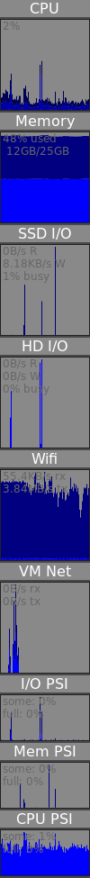

# waymon

A system monitor bar for wayland.

This aims to be something like [gkrellm](http://gkrellm.srcbox.net/) or
[conky](https://github.com/brndnmtthws/conky), but with decent support for
wayland by using the
[layer-shell](https://wayland.app/protocols/wlr-layer-shell-unstable-v1)
protocol.  This allows it to work nicely in tiling compositors like
[sway](https://swaywm.org/).

This code is pretty half-baked at the moment, but has some basic functionality
for showing charts of CPU usage, disk and network I/O, and memory usage.

